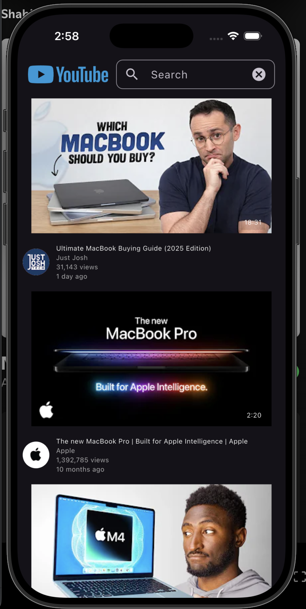

# 🎥 YouTube Clone - Flutter App

<div align="center">
  
  
</div>

## 📱 Overview

A beautiful and modern YouTube clone built with Flutter that provides a seamless video streaming experience. This app replicates the core functionality of YouTube with a clean, intuitive interface and smooth video playback.

## ✨ Features

### 🔍 **Smart Search**
- Real-time video search with instant results
- Clean search interface with custom app bar
- Search suggestions and auto-complete

### 📺 **Video Streaming**
- High-quality video playback using Flutter's video_player
- Tap to play/pause functionality
- Responsive video player with aspect ratio handling
- Smooth video loading and buffering

### 📋 **Video Details**
- Comprehensive video information display
- View count and publish date
- Channel information with avatar
- Expandable video descriptions with rich text formatting
- Subscribe button functionality

### 🎨 **Modern UI/UX**
- Dark theme with Material Design 3
- Custom widgets for video lists
- Responsive design for different screen sizes
- Smooth animations and transitions

## 🛠️ Tech Stack

### **Core Technologies**
- **Flutter** - Cross-platform mobile development framework
- **Dart** - Programming language (SDK >=3.3.0)

### **Key Dependencies**
- **`http: ^1.5.0`** - HTTP client for API requests
- **`video_player: ^2.9.2`** - Video playback functionality
- **`cupertino_icons: ^1.0.8`** - iOS-style icons
- **`flutter_lints: ^5.0.0`** - Code quality and linting

### **Architecture**
- **StatefulWidget** - For dynamic UI components
- **Custom Widgets** - Reusable UI components
- **API Integration** - YouTube Media Downloader API
- **Singleton Pattern** - PlaybackManager for video control

## 🏗️ Project Structure

```
lib/
├── const/
│   └── string.dart          # API configuration
├── Screen/
│   ├── home.dart            # Main search screen
│   └── video_details.dart   # Video player screen
├── services/
│   └── playback_manager.dart # Video playback management
├── widgets/
│   ├── app_bar.dart         # Custom search bar
│   ├── custom_text.dart     # Styled text widget
│   └── video_list.dart      # Video list item widget
└── main.dart                # App entry point
```

## 🚀 Getting Started

### Prerequisites
- Flutter SDK (>=3.3.0)
- Dart SDK
- Android Studio / VS Code
- iOS Simulator / Android Emulator

### Installation

1. **Clone the repository**
   ```bash
   git clone https://github.com/yourusername/youtube-clone-flutter.git
   cd youtube-clone-flutter
   ```

2. **Install dependencies**
   ```bash
   flutter pub get
   ```

3. **Run the app**
   ```bash
   flutter run
   ```

## 🔧 Configuration

### API Setup
The app uses YouTube Media Downloader API. Update the API key in `lib/const/string.dart`:

```dart
class ApiConfig {
  static const String baseUrl = 'https://youtube-media-downloader.p.rapidapi.com';
  static const Map<String, String> headers = {
    'x-rapidapi-key': 'YOUR_API_KEY_HERE',
    'x-rapidapi-host': 'youtube-media-downloader.p.rapidapi.com'
  };
}
```

## 📱 Screenshots

<div align="center">
  
  
</div>

## 🎯 Key Features Implementation

### **Video Search & Discovery**
- Real-time search with YouTube API integration
- Thumbnail previews with duration overlay
- Channel information and view counts
- Published date display

### **Video Playback**
- Custom video player with gesture controls
- Automatic video quality selection
- Playback state management
- Error handling and retry functionality

### **User Interface**
- Material Design 3 with dark theme
- Custom app bar with search functionality
- Responsive video list with thumbnails
- Expandable descriptions with rich text

## 🔄 API Integration

The app integrates with YouTube Media Downloader API to:
- Search for videos by keywords
- Fetch video details and metadata
- Get video streaming URLs
- Retrieve channel information

## 🎨 Custom Widgets

### **CustomAppBar**
- Logo display with search functionality
- Custom text field with prefix/suffix icons
- Search submission handling

### **VideoList**
- Thumbnail with duration overlay
- Channel avatar and information
- Video metadata display
- Tap to navigate to video details

### **CustomText**
- Styled text with customizable properties
- Color, font size, and weight options
- Text overflow handling

## 🚀 Performance Optimizations

- **Lazy Loading** - Videos load as needed
- **Memory Management** - Proper disposal of video controllers
- **Error Handling** - Graceful fallbacks for failed requests
- **State Management** - Efficient widget rebuilds

## 🛡️ Error Handling

- Network error handling with retry options
- Video loading failures with user feedback
- API rate limiting and timeout handling
- Graceful degradation for missing data

## 📦 Dependencies

```yaml
dependencies:
  flutter:
    sdk: flutter
  cupertino_icons: ^1.0.8
  http: ^1.5.0
  video_player: ^2.9.2

dev_dependencies:
  flutter_test:
    sdk: flutter
  flutter_lints: ^5.0.0
```

## 🤝 Contributing

1. Fork the repository
2. Create your feature branch (`git checkout -b feature/AmazingFeature`)
3. Commit your changes (`git commit -m 'Add some AmazingFeature'`)
4. Push to the branch (`git push origin feature/AmazingFeature`)
5. Open a Pull Request

## 📄 License

This project is licensed under the MIT License - see the [LICENSE](LICENSE) file for details.

## 👨‍💻 Author

**Islam Sayed**
- GitHub: [@islam-sayed](https://github.com/islam-sayed)
- LinkedIn: [Islam Sayed](https://linkedin.com/in/islam-sayed)

## 🙏 Acknowledgments

- Flutter team for the amazing framework
- YouTube for the inspiration
- RapidAPI for the YouTube Media Downloader API
- Flutter community for the excellent packages

---

<div align="center">
  <p>Made with ❤️ using Flutter</p>
  <p>⭐ Star this repository if you found it helpful!</p>
</div>